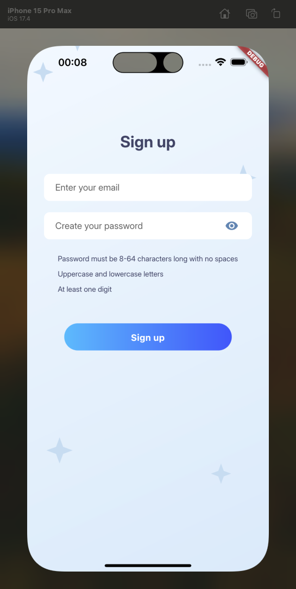
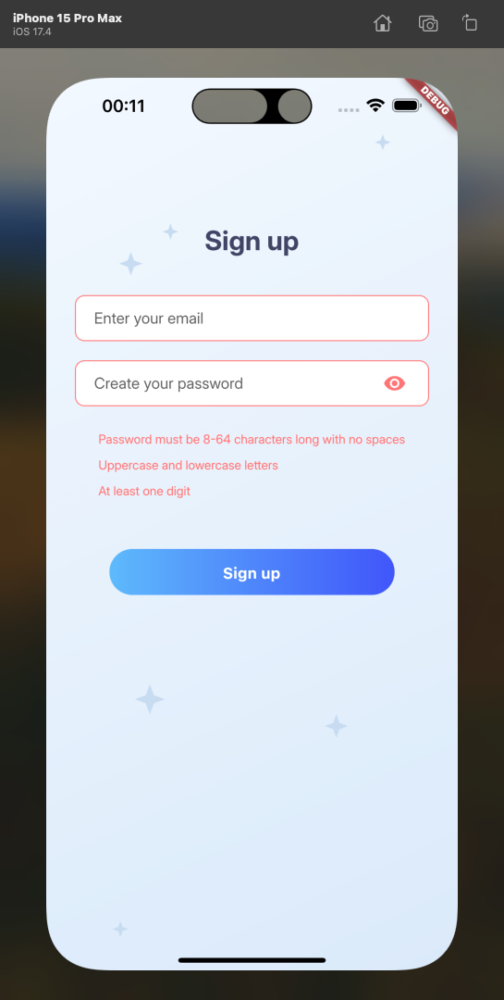
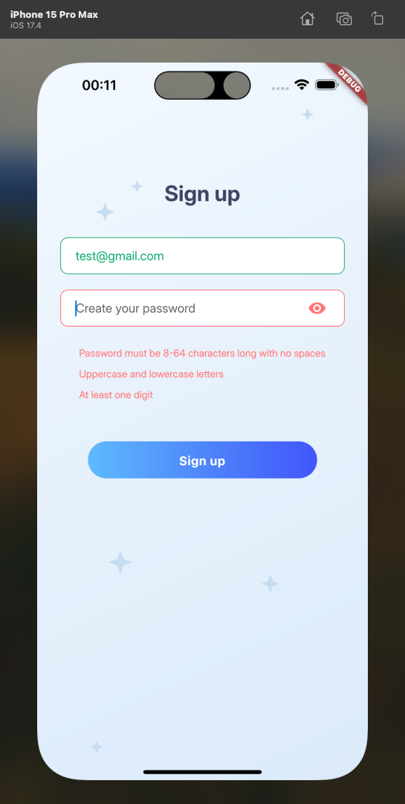
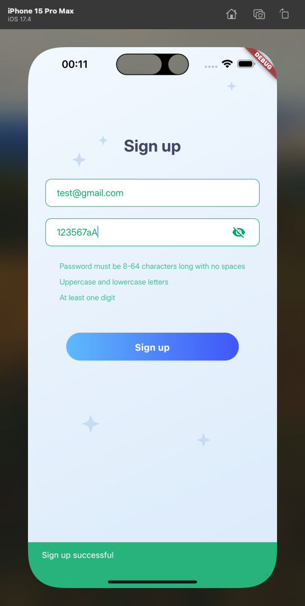

# Clario assessment part 2 - Flutter

## Prerequisites

Before you begin, ensure you have met the following requirements:

- Flutter installed on your machine (version `3.0.5`)
- An IDE (Android Studio, VSCode, etc.)
- A suitable emulator or physical device to run the app

## Installation

To install the project, follow these steps:

```
git clone https://github.com/he-sends-regards/assessment.clario.flutter.git
cd clario.assessment.flutter
flutter pub get
```

To run the project:

```
flutter run
```

## Screenshots from Iphone 15 Pro Max








